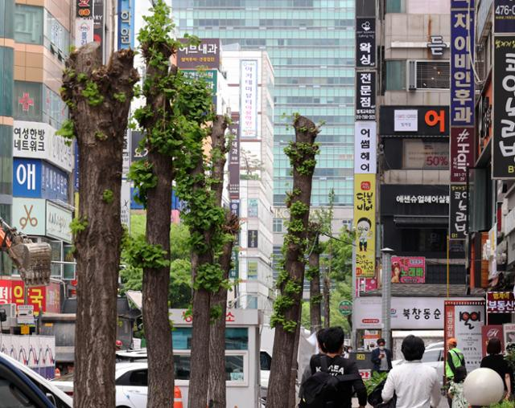
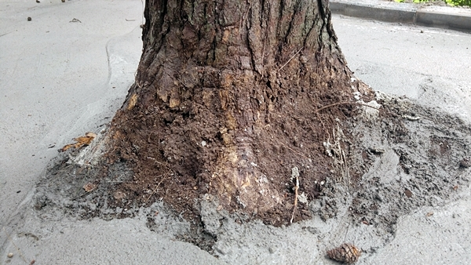
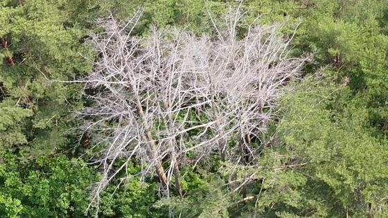

### 휴대폰 사진, SVM, CNN 등의 머신러닝을 활용한 사람들이 거주하는 지역의 나무 건강 상태 판별을 목표로 합니다. 

##### 나무 건강상태 판별 

###### 1. 외관에 의한 측정방법

https://www.uvm.edu/femc/data/archive/project/forest-health-monitoring/dataset/tree-health-and-physiology-measurements/metadata

###### 1) 잘못된 가지치기 

###### 2) 뿌리 주변 시멘트로 덮는 경우

###### 3) 강수량 부족으로 인한 침엽수 고사

https://www.joongang.co.kr/article/23813343#home

###### 2. 정밀 조사

https://www.youtube.com/watch?v=zarll9bx6FI

http://www.newsda.net/news/article.html?no=32126