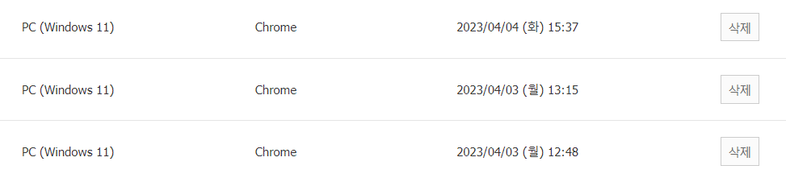

### USER Agent 활용한 접속 디바이스 확인 

아래와 같은 기능을 flask로 구현하여 보안 기능을 강화함. 

 ua = request.headers.get('User-Agent')
 udevice = userdevice.UserDevice()

 udevice 정보를 string matching하여 사용자 정보 획득

https://github.com/seatgeek/thefuzz

### 접속자 ip address 확인

for addr in ni.interfaces():

    if addr == 'en0' or addr =='eth0' or addr=='lo0' or addr=='en1' or addr=='eth1' or addr == 'ens4':

        try:

            ip = ni.ifaddresses(addr)[ni.AF_INET][0]['addr']

            logging.debug("your ip address is : " + ip)

        except:

            logging.debug("exception")

https://pypi.org/project/netifaces/